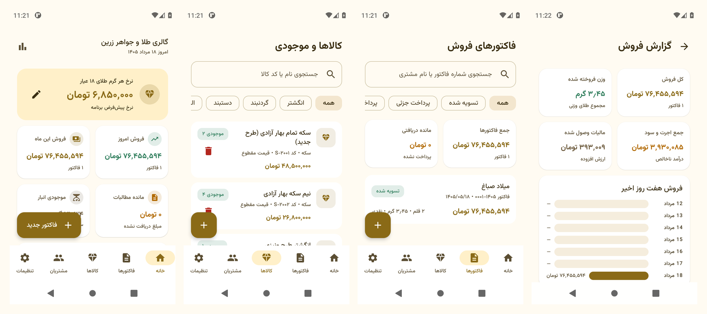
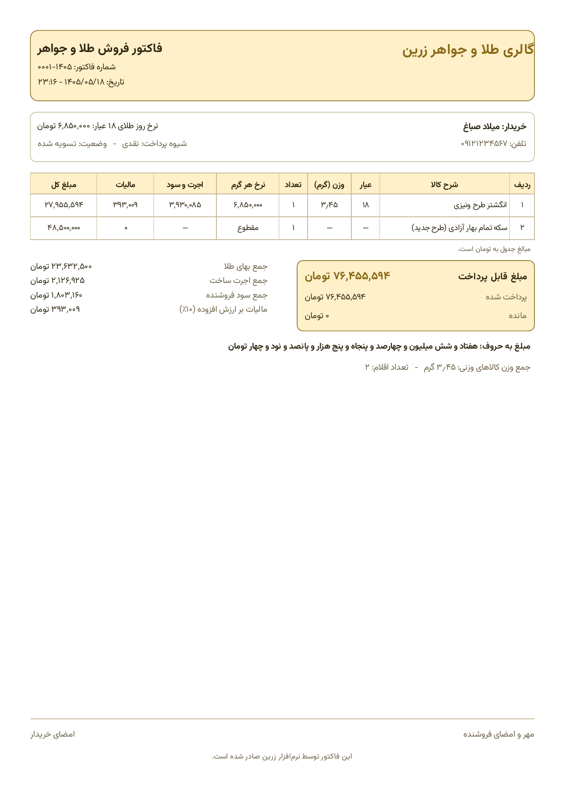

# زرین — نرم‌افزار اندروید فروش طلا و جواهر با صدور فاکتور

اپلیکیشن اندروید برای مدیریت فروش طلافروشی و جواهرفروشی: تعریف کالا و انبار، ثبت مشتری،
محاسبه قیمت بر اساس نرخ روز طلا و صدور فاکتور فروش با خروجی PDF قابل چاپ و اشتراک‌گذاری.

رابط کاربری کاملاً فارسی و راست‌به‌چپ است، تاریخ‌ها شمسی و اعداد با ارقام فارسی نمایش داده می‌شوند.
تمام اطلاعات به‌صورت محلی روی همان دستگاه ذخیره می‌شود و برنامه به اینترنت نیاز ندارد.



## قابلیت‌ها

| بخش | توضیح |
| --- | --- |
| داشبورد | نرخ روز طلای ۱۸ عیار (قابل ویرایش)، فروش امروز و ماه جاری، مانده مطالبات، موجودی انبار و آخرین فاکتورها |
| کالاها و انبار | عیار، وزن، درصد اجرت، درصد سود، بهای نگین، قیمت مقطوع، تعداد موجودی، دسته‌بندی و پیش‌نمایش زنده قیمت |
| مشتریان | نام، تلفن، کد ملی، نشانی و مجموع خرید هر مشتری |
| فاکتور جدید | انتخاب مشتری، افزودن کالا از انبار یا قلم دستی، تغییر تعداد، تخفیف ردیف و کل، شیوه پرداخت و مبلغ پرداختی |
| فاکتورها | فهرست، جست‌وجو، فیلتر وضعیت، جزئیات کامل، ثبت پرداخت و حذف (با بازگرداندن موجودی) |
| خروجی PDF | فاکتور A4 راست‌به‌چپ همراه با «مبلغ به حروف»، آماده اشتراک‌گذاری و چاپ |
| گزارش‌ها | فروش هفت روز اخیر، فروش ماهانه، پرفروش‌ترین کالاها و تفکیک شیوه پرداخت |
| تنظیمات | مشخصات فروشگاه، نرخ روز طلا، درصدهای پیش‌فرض، واحد پول (تومان/ریال) و حالت تاریک |

## نمونه فاکتور PDF

فایل نمونه: [`docs/screenshots/sample-invoice.pdf`](docs/screenshots/sample-invoice.pdf)



## منطق قیمت‌گذاری

محاسبه قیمت کالای وزنی مطابق روال رایج بازار ایران انجام می‌شود:

```
نرخ هر گرم عیار k = نرخ هر گرم طلای ۱۸ عیار × k ÷ ۱۸
بهای طلا            = وزن × نرخ هر گرم
اجرت ساخت           = بهای طلا × درصد اجرت
سود فروشنده         = (بهای طلا + اجرت) × درصد سود
مالیات بر ارزش افزوده = (اجرت + سود) × نرخ مالیات
قیمت نهایی          = بهای طلا + اجرت + سود + مالیات + بهای نگین
```

نکته‌ها:

- مالیات بر ارزش افزوده طلا فقط روی اجرت و سود محاسبه می‌شود، نه روی بهای خود طلا. نرخ آن در تنظیمات
  قابل تغییر است (پیش‌فرض ۱۰٪).
- بهای نگین و سنگ مشمول اجرت، سود و مالیات نمی‌شود.
- کالاهای «قیمت مقطوع» مانند سکه با قیمت ثابت محاسبه می‌شوند و به‌صورت پیش‌فرض معاف از مالیات‌اند.
- تخفیف (ردیف و کل فاکتور) پس از محاسبه مالیات از جمع کم می‌شود.
- همه مبالغ به‌صورت عدد صحیح و بر حسب تومان ذخیره می‌شوند؛ نمایش ریالی فقط یک تبدیل نمایشی است.

## معماری

```
app/src/main/java/ir/zarrin/goldshop/
├── ZarrinApp.kt          نگهدارنده وابستگی‌ها (AppContainer) و کلاس Application
├── MainActivity.kt       نقطه ورود، اعمال تم و راست‌به‌چپ کردن کل برنامه
├── domain/               مدل‌ها، موتور قیمت‌گذاری و ردیف‌های در حال ویرایش فاکتور
├── data/
│   ├── db/               موجودیت‌ها، DAOها و پایگاه داده Room (به‌همراه داده نمونه اولیه)
│   ├── repo/             مخزن‌های کالا، مشتری و فاکتور
│   └── settings/         تنظیمات فروشگاه روی DataStore
├── pdf/                  ساخت PDF فاکتور، اشتراک‌گذاری و چاپ
├── ui/                   صفحه‌ها و ViewModelها (داشبورد، کالاها، مشتریان، فاکتور، گزارش، تنظیمات)
└── util/                 تاریخ شمسی، قالب‌بندی اعداد فارسی و تبدیل عدد به حروف
```

- **Kotlin + Jetpack Compose (Material 3)** برای رابط کاربری
- **Room** برای پایگاه داده و **DataStore** برای تنظیمات
- **Navigation Compose** برای مسیریابی و تزریق وابستگی دستی بدون کتابخانه اضافی
- فونت **وزیرمتن** برای نمایش صحیح فارسی در برنامه و در فایل PDF

## ساخت و اجرا

پیش‌نیاز: JDK 17 و Android SDK با `compileSdk 35`.

```bash
# ساخت نسخه دیباگ
./gradlew :app:assembleDebug

# نصب روی دستگاه یا شبیه‌ساز متصل
./gradlew :app:installDebug

# اجرای تست‌های واحد
./gradlew :app:testDebugUnitTest
```

خروجی APK در مسیر `app/build/outputs/apk/debug/app-debug.apk` ساخته می‌شود.

مسیر Android SDK را در فایل `local.properties` مشخص کنید:

```properties
sdk.dir=/path/to/android-sdk
```

## تست‌ها

۲۸ تست واحد در `app/src/test` نوشته شده است:

- `PricingEngineTest` — محاسبه بهای طلا، اجرت، سود، مالیات، نگین، کالای مقطوع، تخفیف و جمع فاکتور
- `JalaliDateTest` — تبدیل میلادی/شمسی، سال کبیسه، طول ماه‌ها و قالب‌بندی
- `NumberToPersianWordsTest` — تبدیل عدد به حروف فارسی برای «مبلغ به حروف» فاکتور
- `PersianFormattingTest` — ارقام فارسی، جداسازی سه‌رقمی، وزن، درصد و خواندن ورودی کاربر

## داده نمونه

در اولین اجرا، ۱۰ کالای نمونه (انگشتر، سرویس، دستبند، النگو، گوشواره، زنجیر، آویز، انگشتر جواهر،
سکه تمام و نیم سکه) و ۳ مشتری نمونه در پایگاه داده ثبت می‌شود تا برنامه از ابتدا قابل آزمایش باشد.
با حذف داده‌های برنامه (Clear data) این اطلاعات دوباره ساخته می‌شوند.
