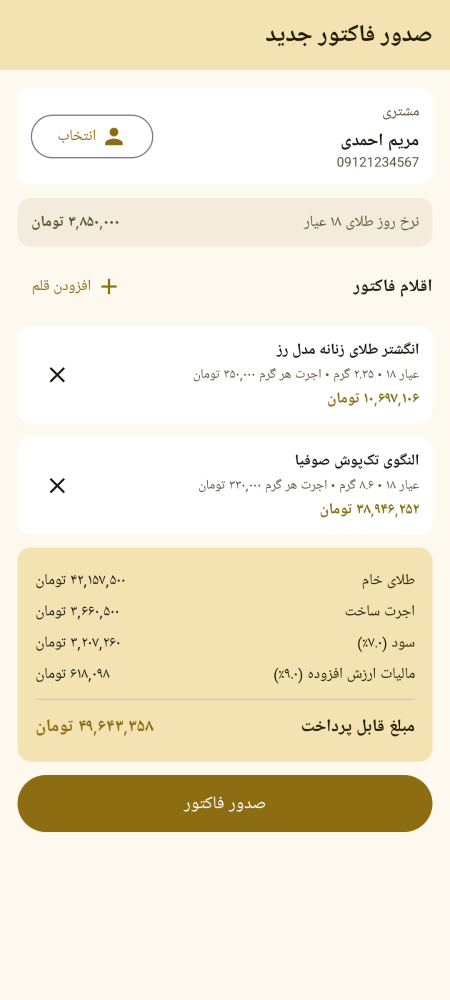
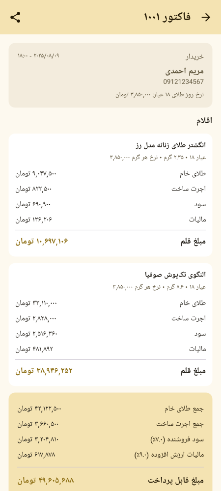
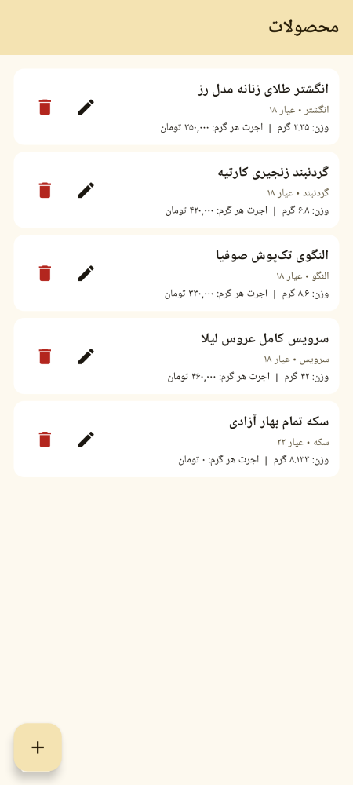
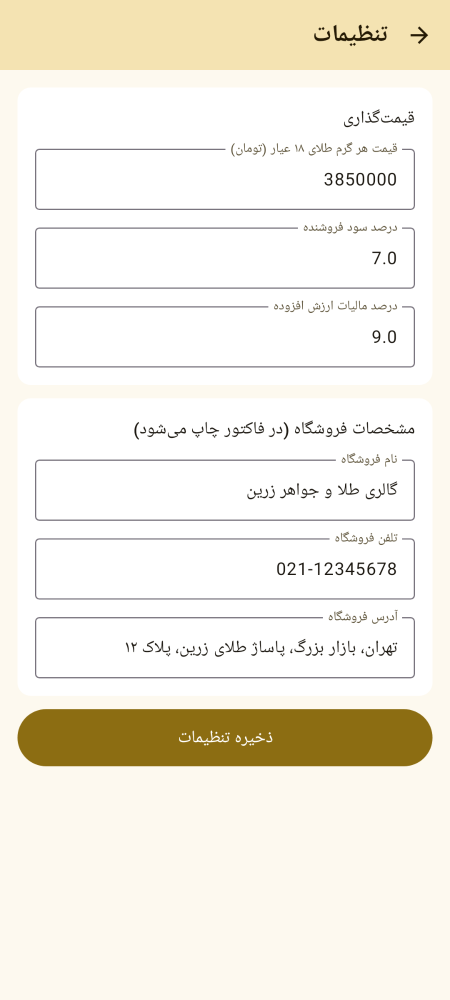

# زرین | Zarrin — اپلیکیشن اندروید فروش طلا و جواهر

اپلیکیشن موبایل اندروید برای مدیریت فروشگاه طلا و جواهر با قابلیت **صدور فاکتور**، محاسبه خودکار قیمت طلا بر اساس نرخ روز، و خروجی PDF فاکتور.

## امکانات

- **داشبورد**: نمایش و ویرایش نرخ روز هر گرم طلای ۱۸ عیار، فروش امروز، فروش کل و آمار فاکتورها
- **مدیریت محصولات**: ثبت و ویرایش کالاها (انگشتر، گردنبند، دستبند، النگو، گوشواره، سرویس، سکه) با عیار، وزن و اجرت ساخت
- **مدیریت مشتریان**: ثبت نام، شماره تماس و آدرس
- **صدور فاکتور**: انتخاب مشتری، افزودن اقلام از کاتالوگ یا به‌صورت دستی، محاسبه لحظه‌ای مبلغ
- **محاسبه قیمت طبق قواعد طلافروشی ایران**:
  - طلای خام = وزن × نرخ روز (تبدیل بر اساس عیار: ۱۸/۲۱/۲۲/۲۴)
  - اجرت ساخت = وزن × اجرت هر گرم
  - سود فروشنده = درصدی از (طلای خام + اجرت) — پیش‌فرض ۷٪
  - مالیات ارزش افزوده = درصدی از (اجرت + سود) — پیش‌فرض ۹٪ (بدون احتساب ارزش طلا)
- **خروجی PDF فاکتور** با سربرگ فروشگاه و اشتراک‌گذاری (واتس‌اپ، تلگرام و…)
- **رابط کاربری کاملاً فارسی و راست‌به‌چپ** با اعداد فارسی و تم طلایی
- شماره‌گذاری خودکار فاکتورها و ذخیره نرخ روز لحظه فروش روی هر فاکتور

## تکنولوژی‌ها

- Kotlin + Jetpack Compose (Material 3)
- Room (SQLite) برای ذخیره‌سازی محصولات، مشتریان و فاکتورها
- DataStore برای تنظیمات (نرخ روز، درصد سود و مالیات، مشخصات فروشگاه)
- Navigation Compose + MVVM (ViewModel + StateFlow)
- `PdfDocument` اندروید برای تولید PDF + `FileProvider` برای اشتراک‌گذاری

## ساخت و اجرا

```bash
./gradlew :app:assembleDebug        # ساخت APK در app/build/outputs/apk/debug/
./gradlew :app:testDebugUnitTest    # تست‌های واحد منطق قیمت‌گذاری
./gradlew :app:recordPaparazziDebug # تولید اسکرین‌شات‌های UI (Paparazzi)
./gradlew :app:verifyPaparazziDebug # تأیید اسنپ‌شات‌ها
```

## اسکرین‌شات‌ها

| داشبورد | فاکتور جدید | جزئیات فاکتور |
|---|---|---|
|  |  |  |

| محصولات | فاکتورها | تنظیمات |
|---|---|---|
|  |  |  |
